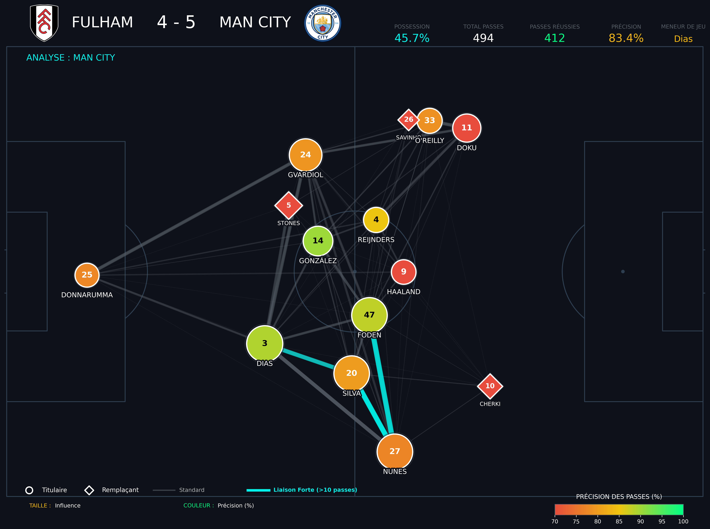

# ⚽ Football Passing Network Analyzer

Visualisation des réseaux de passes pour l'analyse tactique footballistique.


## 📸 Aperçu



*Analyse du réseau de passes de Manchester City lors de la victoire 5-4 contre Fulham*

## 🎯 Fonctionnalités

- **Visualisation moderne** : Design sombre professionnel avec thème personnalisé
- **Métriques avancées** : Centralité d'eigenvector, précision des passes, influence des joueurs
- **Export haute qualité** : PNG 300 DPI + PDF vectoriel
- **Analyse tactique** : Identification des liaisons fortes, joueurs clés et schémas de jeu
- **Totalement personnalisable** : Logos d'équipes, couleurs, statistiques

## 🚀 Installation rapide

### Prérequis
```bash
Python 3.8+
pip
```

### Installation des dépendances
```bash
pip install pandas numpy matplotlib mplsoccer networkx
```

### Utilisation
```bash
python passing_network_viz.py
```

## 📊 Structure des données

Le script nécessite 4 fichiers CSV :

```
project/
│
├── passing_network_viz.py
├── match_events_rows.csv      # Événements du match
├── players_rows.csv            # Informations joueurs
├── team_match_stats.csv        # Statistiques équipes
├── matches_rows.csv            # Infos match
├── Fulham.png                  # Logo équipe domicile
└── Man City.png                # Logo équipe extérieure
```


## 🎨 Personnalisation

### Modifier le thème de couleurs

```python
class ModernTheme:
    BACKGROUND = '#0e1117'      # Fond général
    PASS_HIGH = '#00ff85'        # Passes >90% précision
    PASS_MID = '#f1c40f'         # Passes 80-90%
    PASS_LOW = '#e74c3c'         # Passes <80%
    LINK_STRONG = '#00F2EA'      # Liaisons fortes
    PRIMARY = '#00F2EA'          # Couleur accent
```

### Ajuster les seuils

```python
# Dans la fonction plot_professional_network()
min_pass_threshold = 1           # Minimum de passes à afficher
strong_thresh_val = max_passes * 0.8  # Seuil liaison forte (80%)
```

## 📈 Métriques calculées

| Métrique | Description |
|----------|-------------|
| **Centralité d'eigenvector** | Mesure l'influence d'un joueur dans le réseau |
| **Précision des passes** | % de passes réussies par joueur |
| **Liaisons fortes** | Connexions > 80% du maximum de passes |
| **Position moyenne** | Coordonnées moyennes du joueur sur le terrain |

## 🎓 Interprétation

### Taille des nœuds
Plus le nœud est **grand**, plus le joueur est **influent** dans la circulation du ballon.

### Couleur des nœuds
- 🟢 **Vert** : Précision >90% (excellente)
- 🟡 **Jaune** : Précision 80-90% (bonne)
- 🔴 **Rouge** : Précision <80% (perfectible)

### Épaisseur des lignes
Plus la ligne est **épaisse**, plus les joueurs **échangent de passes**.

### Lignes cyan
Indiquent les **axes de jeu privilégiés** (>80% du maximum de passes).

## 💾 Export

Le script génère automatiquement :
- `passing_network.png` (300 DPI - 2-4 MB)
- `passing_network_VECTOR.pdf` (vectoriel - zoom infini)

## 🛠️ Technologies utilisées

- **Python 3.8+**
- **pandas** : Traitement des données
- **numpy** : Calculs numériques
- **matplotlib** : Visualisation
- **mplsoccer** : Terrains de football
- **networkx** : Analyse de graphes

---
